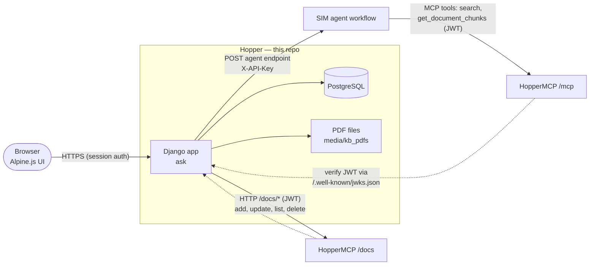
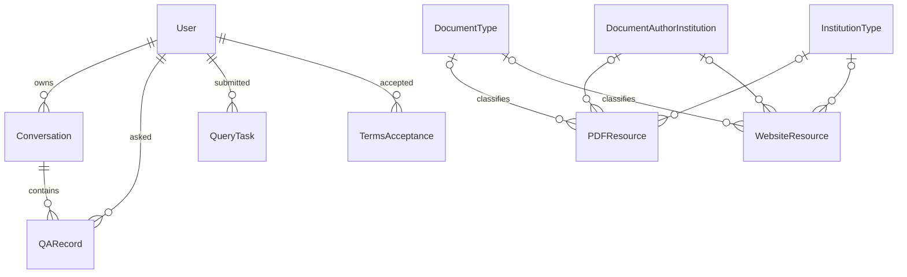
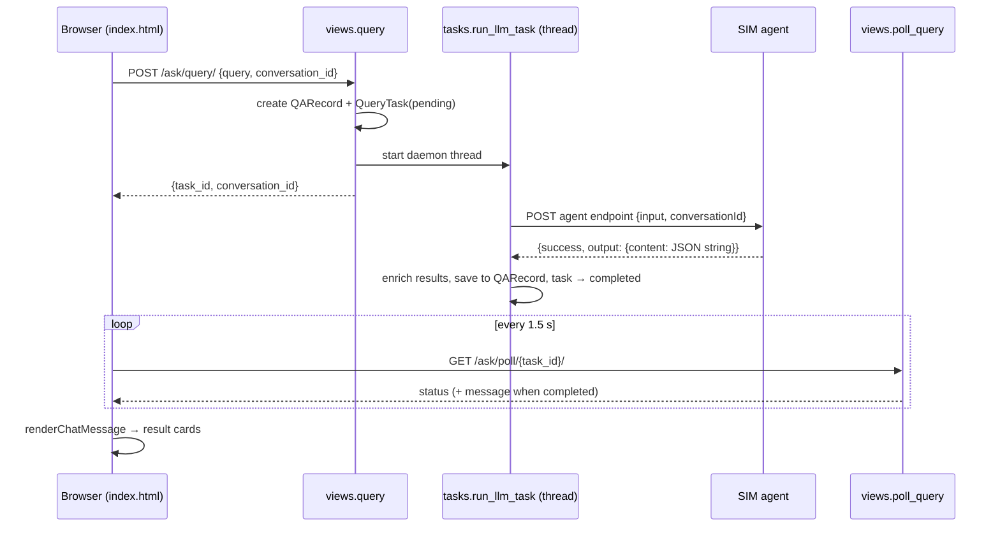
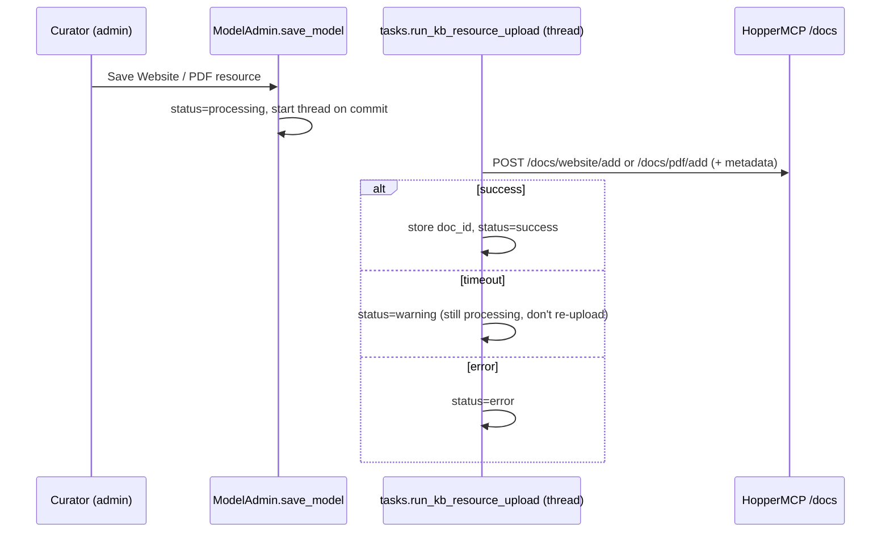

# Hopper — Documentation

Hopper is a basic chat client that can connect to AI agents using workflows built with [SIM](https://github.com/simstudioai/sim). 

For end-user instructions, see [USER_GUIDE.md](USER_GUIDE.md).

## Contents

1. [Architecture](#architecture)
2. [Code map](#code-map)
3. [Data model](#data-model)
4. [Workflows](#workflows)
5. [Endpoints](#endpoints)
6. [Agent (LLM) contract](#agent-llm-contract)
7. [Users, roles and permissions](#users-roles-and-permissions)
8. [Configuration](#configuration)
9. [Running Hopper](#running-hopper)
10. [First-time setup](#first-time-setup)

## Architecture

### System context



### Request flow at a glance

1. The user signs in (allauth session) and must accept the current Terms of Use (middleware).
2. A question is POSTed to `/ask/query/`. Hopper stores it, starts a background thread and returns a task id immediately.
3. The thread calls the active SIM workflow endpoint and waits (up to `LLM_TIMEOUT`) for the agent's answer.
4. Hopper **enriches** the answer: it matches each result to its own PDF or website records, tags the type and publisher, and points PDF links at Hopper's copy of the file.
5. The browser polls `/ask/poll/<task_id>/` every 1.5 seconds and renders the result cards when the task is complete.

---

## Code map

Everything lives in the Django project `hospexplorer/`, which has a single app, `ask`.

| Path | Responsibility |
|---|---|
| `hospexplorer/hospexplorer/settings.py` | All settings, most read from environment variables (see [Configuration](#configuration)) |
| `hospexplorer/hospexplorer/urls.py` | Root URLconf. Everything is mounted under `APP_ROOT`: login page, allauth, the OIDC provider, admin, `ask/` and the protected PDF route. |
| `ask/models.py` | All models (see [Data model](#data-model)) |
| `ask/views.py` | Chat page, question submission and polling, terms, history deletion, the knowledge base page and its JSON actions, protected PDF serving |
| `ask/urls.py` | `ask:` URL names |
| `ask/tasks.py` | Background thread targets: `run_llm_task` (ask the agent and enrich the answer) and `run_kb_resource_upload` (push a resource to HopperMCP) |
| `ask/llm_connector.py` | Single outbound call to the agent: chooses the endpoint (active `SimWorkflow` or `LLM_HOST`) and POSTs the question |
| `ask/kb_connector.py` | HTTP client for HopperMCP's `/docs` API: list, add website, add or update PDF, download PDF, delete. Includes the PDF retry and timeout policy. |
| `ask/admin.py` | Admin for every model: background KB upload on save, KB delete on delete, ZIP import of PDFs, CSV import for lookup lists, SIM workflow activation |
| `ask/admin_csv.py` | Helpers: partial ISO date validation, single-column CSV import |
| `ask/middleware/terms_middleware.py` | Redirects signed-in users who haven't accepted the current `TERMS_VERSION` |
| `ask/context_processors.py` | Injects sidebar conversations and terms status into every template |
| `ask/templates/_base.html` | Layout: sidebar (conversations, New Chat, Knowledge Base, Admin, user menu), delete-history modal |
| `ask/templates/index.html` | Chat UI (Alpine component) and `window.renderChatMessage`, which renders answers as result cards or Markdown |
| `ask/templates/kb/resources.html` | Knowledge Base page: resource tables and the compare/sync UI |
| `ask/templates/admin/...` | Admin overrides: "Upload zip of PDFs" and "Import CSV" buttons and forms, "Hopper Admin" branding |
| `ask/templates/account/...` | allauth login and password-reset templates |
| `ask/templates/terms/...` | Terms of Use text (`terms_of_use_content.html`), accept page and view page |
| `ask/static/` | CSS (`ask.css`, `styles.css`, admin CSS), sidebar JS and images |
| `ask/tests.py` | Django tests (PDF deletion, CSV and ZIP import, KB tracking views, KB PDF download) |
| `mockoon/llm-mock.json` | Mock agent used by the dev Compose stack |
| `docker/` | Container entry scripts and Supervisor config |

---

## Data model



### Chat

| Model | Purpose | Key fields |
|---|---|---|
| `Conversation` | A chat thread | `user`; `title` (the first question, up to 200 characters); `llm_conversation_id` (UUID sent to the agent as `conversationId` so it can keep its own memory; separate from the integer PK used in URLs); `updated_at` (touched on each answer, which drives sidebar ordering) |
| `QARecord` | One question and its answer (permanent history) | `conversation`, `user`, `question_text`, `answer_text` (the enriched JSON string that is rendered), `answer_raw_response` (the agent's full response), `is_error`, timestamps |
| `QueryTask` | Short-lived polling handle for one in-flight question | UUID `id`, `user`, `query_text`, `status` (`pending` → `processing` → `completed` or `failed`), `result`, `error_message` |
| `TermsAcceptance` | Audit record of a user accepting a terms version | `user`, `terms_version`, `accepted_at` (read-only in admin) |

### Knowledge base resources

`WebsiteResource` and `PDFResource` inherit from the abstract `Resource` model:

| Field | Notes |
|---|---|
| `title`, `description` | |
| `creator`, `modifier`, `created_at`, `modified_at` | Set by the admin or views |
| `status`, `status_message` | Upload state shown in admin: `processing`, `success`, `warning` (for example "still processing in the KB") or `error` |
| `date_published` | **String**, a partial ISO date: `YYYY`, `YYYY-MM` or `YYYY-MM-DD`. Sorting the strings sorts the dates chronologically. |
| `document_type`, `document_author_institution`, `institution_type` | Optional FKs to the lookup tables `DocumentType`, `DocumentAuthorInstitution` and `InstitutionType` (each just a unique `name`) |
| `publisher` | Free text. The value `State` is special: results from state publishers are listed first in answers. |
| `mcp_kb_document_id` | The HopperMCP document id. This links a Hopper record to its knowledge base copy. `NULL` means not (yet) in the KB. |

Specific fields:

- `WebsiteResource.url`
- `PDFResource.file`: stored under `MEDIA_ROOT/kb_pdfs/`. It may be empty for resources that are tracked from the KB without a local copy.
- `PDFResource.original_filename`: the uploaded file name before Django renames it to avoid collisions. Together with `title`, it's used to skip duplicates on ZIP import.
- `PDFResource.delete()` also deletes the file from storage. If that fails, it sets `file_deletion_failed` so the admin can warn that the file is still on disk.

The metadata fields are sent to HopperMCP as the document's `metadata` (FKs flattened to their names), so the agent can see them.

### Agent configuration

| Model | Purpose |
|---|---|
| `SimWorkflow` | A SIM workflow Hopper can talk to: `title`, `description`, `workflow_id` (informational only), `agent_endpoint` (the URL Hopper POSTs to), `workflow_type` (only `agent` at the moment), `is_active`. **Exactly one workflow per type can be active.** Activating one deactivates the others, and the last active workflow can't be deactivated or deleted. |

---

## Workflows

### 1. Sign-in and Terms of Use

`TermsAcceptanceMiddleware` redirects signed-in users to `/ask/terms/accept/` until they have accepted the current `TERMS_VERSION`. The accepted version is cached in the session. The terms text is `templates/terms/terms_of_use_content.html`. Changing `TERMS_VERSION` in `settings.py` makes every user accept the terms again.

### 2. Asking a question



- **Endpoint:** the active `SimWorkflow`'s `agent_endpoint` is used, or `LLM_HOST` if none is active.
- **Enrichment** (`_enrich_search_results`): each result's `document_id` is matched to a `PDFResource` or `WebsiteResource`. The result is then tagged with its `type` and `publisher`, and PDF links are rewritten to Hopper's protected file URL.
- **Ordering and rendering:** `poll_query` lists `State` publishers first. `renderChatMessage` draws result cards, including "Relevant pages" links, and falls back to Markdown for anything that isn't JSON.
- A question sent without a `conversation_id` is added to the user's most recent conversation. **New Chat +** creates a new one.

### 3. Adding knowledge base resources (admin)



- PDF uploads are retried on connection errors but not on timeouts, because a retry after a timeout would create a duplicate.
- **Upload zip of PDFs** imports a ZIP containing PDFs and a single CSV, creating one resource and one upload thread per row. The CSV format is described in [USER_GUIDE.md](USER_GUIDE.md#adding-documents).
- Lookup lists (document types, institutions, institution types) can be filled with **Import CSV** in admin.

### 4. Deleting resources

Deleting a resource in admin first deletes it from HopperMCP. If that fails, the Hopper record is kept and an error is shown. PDFs also have their local file removed.

### 5. Knowledge Base page

`/ask/kb/` lists Hopper's resources. **Compare with Knowledge Base** fetches every KB document and marks each resource **In Sync** or **Missing from KB**. Websites are matched by URL and PDFs by `mcp_kb_document_id`. KB documents that Hopper doesn't track are listed separately. Depending on the user's permissions, they can then:

| Button | Does | Permission |
|---|---|---|
| **Add to KB** | Re-sends a missing resource to the KB | `change_websiteresource` / `change_pdfresource` |
| **Track in Hopper** | Creates or links a Hopper record for an untracked KB document (downloads the PDF if needed) | `add_websiteresource` / `add_pdfresource` |
| **Remove from KB** | Deletes an untracked document from the KB | `delete_websiteresource` |

### 6. Choosing the agent (SIM workflows)

In admin under **Sim Workflows**, the active workflow's `agent_endpoint` receives all new questions. Only one workflow can be active; activating one deactivates the others.

### 7. Issuing tokens for HopperMCP (OIDC provider)

Hopper is the OpenID Connect provider for the platform. Tokens are requested at `/<APP_ROOT>identity/o/api/token` with a `client_credentials` client, signed with `IDP_OIDC_PRIVATE_KEY`, and verified by HopperMCP through `/<APP_ROOT>.well-known/jwks.json`. See [First-time setup](#first-time-setup).

---

## Endpoints

All paths are relative to `/<APP_ROOT>`. Except for the login page and the allauth and OIDC routes, every endpoint requires a signed-in session. JSON endpoints called from the page send the CSRF token in the `X-CSRFToken` header.

### Pages and chat (`ask/`)

| Method | Path | Name | Description |
|---|---|---|---|
| GET | `` (root) | `home` | Login page (allauth `LoginView`) |
| GET | `ask/` | `ask:index` | Chat page with no conversation selected |
| POST | `ask/new/` | `ask:new-conversation` | Create an empty conversation and redirect to it |
| GET | `ask/c/<id>/` | `ask:conversation` | Chat page for one of the user's conversations (other users' ids redirect to `ask:index`) |
| POST | `ask/query/` | `ask:query-llm` | Body `{"query": "...", "conversation_id": <int or null>}` → `{"task_id", "conversation_id", "conversation_title"}`. `400` if the query is empty or the body is invalid. |
| GET | `ask/poll/<task_id>/` | `ask:poll-query` | → `{"status": "pending" \| "processing"}`, `{"status": "completed", "message": "<JSON string>"}` or `{"status": "failed", "error": "..."}`. `404` if the task isn't the user's. |
| DELETE | `ask/history/delete` | `ask:delete-history` | Delete all of the user's conversations and their Q&A records |
| GET, POST | `ask/terms/accept/` | `ask:terms-accept` | Show or accept the current Terms of Use |
| GET | `ask/terms/` | `ask:terms-view` | View the terms and the user's acceptance status |
| GET | `ask/mock` | `ask:mock-response` | Returns a static response in the agent's response format (for manual testing) |
| GET | `media/kb_pdfs/<filename>` | `get_pdf` | Serves an uploaded PDF to signed-in users (PDF links in answers point here) |

### Authentication and identity (allauth)

| Path | Description |
|---|---|
| `accounts/login/`, `accounts/logout/` | Sign in and out |
| `accounts/password/reset/` (and the follow-up key pages) | Password reset by email |
| `accounts/...` | Other allauth account pages |
| `.well-known/openid-configuration`, `.well-known/jwks.json` | OIDC discovery and signing keys |
| `identity/o/api/token` | OAuth2 token endpoint (used with the `client_credentials` grant) |
| `identity/o/authorize`, `identity/o/api/userinfo`, `identity/o/api/revoke`, ... | Other standard OIDC endpoints (currently unused by the platform) |

### Admin (`admin/`)

Standard Django admin ("Hopper Admin") plus these custom views:

| Path | Description |
|---|---|
| `admin/ask/pdfresource/upload-zip/` | Bulk-import PDFs from a ZIP with a CSV |
| `admin/ask/documenttype/import-csv/` | Import document types from a CSV |
| `admin/ask/documentauthorinstitution/import-csv/` | Import document author institutions from a CSV |
| `admin/ask/institutiontype/import-csv/` | Import institution types from a CSV |

---

## Agent (LLM) contract

Everything Hopper needs from the SIM workflow is defined by this request and response.

**Request** (from `llm_connector.query_llm`):

```http
POST <active SimWorkflow.agent_endpoint or LLM_HOST>
X-API-Key: <LLM_TOKEN>
Content-Type: application/json

{"input": "<user question>", "conversationId": "<Conversation.llm_conversation_id UUID>"}
```

The timeout is `LLM_TIMEOUT` seconds (default 120). A non-2xx status fails the question.

**Response** (any other shape fails the question):

```json
{
  "success": true,
  "output": {
    "content": "{\"search_results\": [ ... ]}"
  }
}
```

`output.content` is a **string** containing JSON with a `search_results` array. Fields per result:

| Field | Required | Used for |
|---|---|---|
| `title` | yes | Card title |
| `url` | no | Title link. For PDFs, Hopper replaces it with its own file URL. |
| `summary` | yes | Card body |
| `relevance` | no | "Relevance:" line |
| `document_id` | recommended | Matching to Hopper resources (type, publisher, local PDF link). Accepts an int or a chunk id like `"12-3"`. |
| `pages` | no | List of `{"page_number": <int>, "chunk": "<excerpt>"}`, rendered as "Relevant pages" with `#page=N` deep links |

Hopper adds `type` (`PDF` or `Website`) and `publisher` to each result before it's stored and rendered.

---

## Users, roles and permissions

| Role | How to grant | Can do |
|---|---|---|
| **User** | Create the account in admin (**Users → Add**: username, email, password) | Chat, see their own conversations, view the Knowledge Base page and run **Compare** |
| **Staff** | Tick **Staff status** on the user | Sees the **Admin** button; accesses the admin sections they have model permissions for |
| **Curator** | Grant model permissions, ideally through a group (for example "curator"): `add/change/delete/view` on *website resource* and *pdf resource*, plus the lookup models | Admin resource management and the Knowledge Base page buttons (see the permission column in [workflow 5](#5-knowledge-base-page)) |
| **Superuser** | `manage.py createsuperuser`, or tick **Superuser status** | Everything, including SIM workflows, OIDC clients and users |

A conversation is only ever visible to its owner, and polling is limited to the user's own tasks.

---

## Configuration

Three files, each created from its example template (`.app_env_example`, `.docker-env-example`, `.env-example`). None of them are committed.

| File | Loaded by | Purpose |
|---|---|---|
| `.app_env` | `docker/startup.sh` and `docker/hopper-gunicorn.sh` (`source`); also `env_file` of the dev `web` service | Application settings (shell `export` syntax) |
| `.docker-env` | `env_file` of the `db` (and prod `web-prod`) service; sourced by the Gunicorn script | Postgres container credentials, host and CSRF settings, `APP_ROOT` |
| `.env` | Docker Compose variable substitution (prod file) | `WEB_PORT`, `DB_PORT` |

### Environment variables read by `settings.py`

| Variable | Default | Purpose |
|---|---|---|
| `POSTGRES_NAME`, `POSTGRES_USER`, `POSTGRES_PASSWORD` | — | Database credentials (host is fixed to `db`, port `5432`). **`POSTGRES_NAME` must equal `POSTGRES_DB`** in `.docker-env`, which is the database the Postgres container creates. |
| `IDP_OIDC_PRIVATE_KEY` | — (**required**, startup fails without it) | RSA private key (PEM) used to sign OIDC tokens. Generate with `openssl genpkey -algorithm RSA -out private_key.pem -pkeyopt rsa_keygen_bits:2048`. In `.app_env`, end each line of the key with `\`. |
| `APP_ROOT` | `""` | URL prefix, for example `hopper/`. Must end with `/` when set. |
| `DJANGO_ALLOWED_HOSTS` | `localhost` | Comma-separated |
| `CSRF_TRUSTED_ORIGINS` | `http://localhost/` | Comma-separated |
| `DEBUG` | `True` | Django debug mode |
| `LLM_HOST` | `http://mock:3000/` | Agent endpoint used when no active SIM workflow has an endpoint |
| `LLM_TOKEN` | `""` | Sent as `X-API-Key` on **every** agent request, including to SIM workflow endpoints |
| `LLM_TIMEOUT` | `120` | Seconds to wait for the agent |
| `LLM_MODEL`, `LLM_QUERY_ENDPOINT`, `LLM_MAX_TOKENS` | — | Defined but not used by the current code |
| `KB_MCP_HOST` | `http://localhost:8002` | HopperMCP base URL, **without a trailing slash**. From inside Docker, use `http://host.docker.internal:8002`. |
| `KB_MCP_JWT_TOKEN` | `""` | Bearer token for HopperMCP (see [First-time setup](#first-time-setup)) |
| `KB_MCP_TIMEOUT` | `30` | Seconds; used for list, website and delete calls |
| `KB_MCP_PDF_TIMEOUT` | `300` | Seconds; used for PDF add, update and download |
| `KB_MCP_PDF_RETRIES` | `2` | Attempts for PDF add and update on transport errors |
| `KB_PDF_MAX_SIZE_MB` | `20` | Size limit for `ask/kb/upload-pdf/` |
| `PDF_ZIP_CSV_COLUMNS` | `filename,title` | Names of the filename and title columns in the ZIP-import CSV, in that order |
| `KB_RESOURCES_PAGE_SIZE` | `20` | Rows per table on the Knowledge Base page |
| `SIDEBAR_CONVERSATIONS_LIMIT` | `10` | Conversations shown in the sidebar |
| `EMAIL_HOST`, `EMAIL_PORT`, `EMAIL_HOST_USER`, `EMAIL_HOST_PASSWORD`, `DEFAULT_FROM_EMAIL` | — | SMTP settings. Only used after switching `EMAIL_BACKEND` to SMTP in `settings.py`; by default emails such as password resets are **printed to the console log**. |

Settings changed only in code: `TERMS_VERSION` (currently `0.1`), `EMAIL_BACKEND`, login and logout redirects, allauth options (login by username or email, email verification optional), token lifetime (10 years), `SECRET_KEY`.

---

## Running Hopper

### Development (Docker)

```bash
cp .app_env_example .app_env      # set IDP_OIDC_PRIVATE_KEY, POSTGRES_* (match .docker-env), KB_MCP_*
cp .docker-env-example .docker-env
cp .env-example .env
docker compose up
```

- Services: `db` (Postgres 16, named volume `postgres_data`), `mock` (Mockoon on port 3000, serving `mockoon/llm-mock.json`), and `web` (`runserver` on port 8000 with the repo bind-mounted, so code changes reload automatically).
- `docker/startup.sh` sources `.app_env`, runs `migrate` and starts `runserver 0.0.0.0:8000`.
- Open `http://localhost:8000/<APP_ROOT>` to sign in; the chat is at `/<APP_ROOT>ask/`.
- With no active SIM workflow, questions go to the mock at `LLM_HOST=http://mock:3000/`.

### Production (Docker)

```bash
docker compose -f docker-compose-prod.yml up -d
```

- `web-prod` builds `Dockerfile-prod` and runs **Supervisor**, which runs `docker/hopper-gunicorn.sh`: source `.app_env` and `.docker-env`, `migrate`, `collectstatic`, then Gunicorn with 3 workers, a 360-second timeout, bound to `:8000`.
- Postgres data lives in `./data/db`; the DB port is published as `${DB_PORT}`.
- Logs are in `./logs/` (`hopper_app.log`, `hopper_supervisor.log`, `supervisord.log`).
- Uploaded PDFs are stored in `hospexplorer/media/kb_pdfs/`, inside the bind-mounted repo. Back this directory up together with the database.
- There's no mock service; configure a SIM workflow or `LLM_HOST`.

### Without Docker

Settings hard-code the database host `db`, so you need a Postgres server reachable under that hostname (for example, an `/etc/hosts` entry). Then:

```bash
source .app_env
cd hospexplorer
uv run python manage.py migrate
uv run python manage.py runserver
```

### Tests

```bash
docker compose exec web bash -c "source .app_env && cd hospexplorer && uv run python manage.py test ask"
```

Tests use Django's test database, which is created on the configured Postgres server, and mock all HopperMCP calls. Make sure `POSTGRES_NAME` and the credentials in `.app_env` point at a database the user can access.

---

## First-time setup

1. **Start the stack** (see [Running Hopper](#running-hopper)) and create an admin account:
   `docker compose exec web bash -c "source .app_env && cd hospexplorer && uv run python manage.py createsuperuser"`
2. **Start HopperMCP** (its own repo and Compose stack). Point its `JWKS_ENDPOINT` at Hopper's `/<APP_ROOT>.well-known/jwks.json`.
3. **Create an OIDC client** in Hopper's admin: **OpenID Connect IdP → Clients → Add**. Set **Grant types** to `client_credentials`, save, and copy the secret; **it's shown only once**.
4. **Get a token:**
   ```bash
   curl -X POST http://localhost:8000/<APP_ROOT>identity/o/api/token \
        -d grant_type=client_credentials -d client_id=<id> -d client_secret=<secret>
   ```
   Put `access_token` into `KB_MCP_JWT_TOKEN` in `.app_env` and restart `web`. Set HopperMCP's `ISSUER_URL` to the token's `iss` claim. Use the same method to create a token for the SIM agent's MCP connection.
5. **Configure the agent:** in admin, **Sim Workflows → Add**, enter the workflow's execution URL as **Agent endpoint**, tick **Is active** and save. Set `LLM_TOKEN` to the API key the SIM deployment expects.
6. **Load lookup lists** (optional): Document Types, Document Author Institutions and Institution Types → **Import CSV**.
7. **Add content:** PDF Resources and Website Resources (one at a time, or **Upload zip of PDFs**), then check the status column and the Knowledge Base page's **Compare with Knowledge Base**.
8. **Create users** and grant staff or curator permissions as needed.
