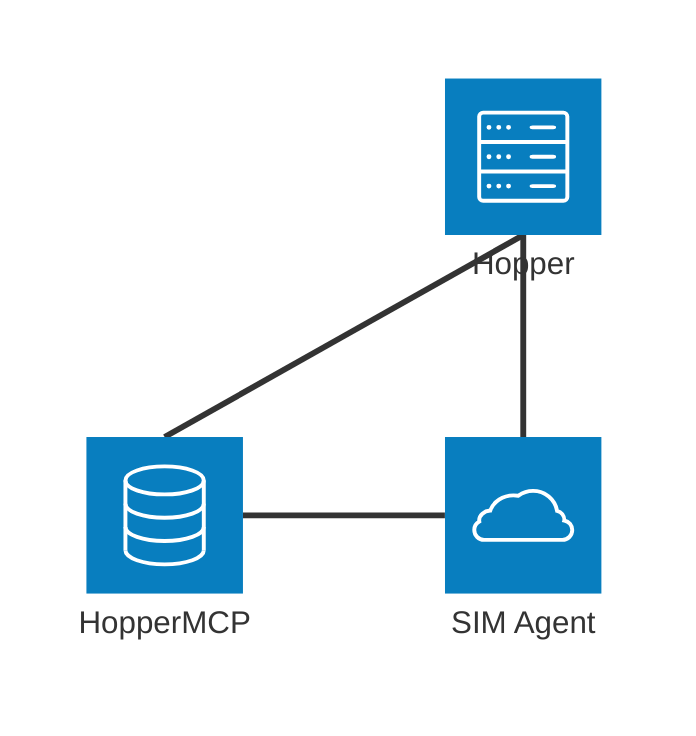

# Hopper 

Hopper is a basic chat client that can connect to AI agents using workflows built with [SIM](https://github.com/simstudioai/sim). 

## Requirements

This is a Django app with dependencies managed through [uv](https://docs.astral.sh/uv/). You can also run the application using Docker Compose.

## Installation Instructions

- [uv](https://docs.astral.sh/uv/getting-started/installation/)
- [Docker Desktop](https://www.docker.com/products/docker-desktop/)

## Configuration

Create the configuration files from the example files:

```
cp .app_env_exmaple .app_env
cp .docker-env-example .docker-env
cp .env-example .env
```

### .app_env

Set the private key (`IDP_OIDC_PRIVATE_KEY`). You can generate a key using:
```
openssl genpkey -algorithm RSA -out private_key.pem -pkeyopt rsa_keygen_bits:2048
```

In the config file, make sure to end each line with `\` so the key gets read properly into the variable.

Replace the PostgreSLQ password by setting `POSTGRES_PASSWORD`. Once Hopper is running, you can get a token to be configured via `KB_MCP_JWT_TOKEN`.

You can get an access token by making a POST request to `http://your.hopper.app/identity/o/api/token` using the grant type `client_credentials`, a `client_id` and a `client_secret`.

### .docker-env

- Set the PostgreSQL password you set in `.app_env` via `POSTGRES_PASSWORD`.
- Set `DJANGO_SECRET_KEY`.
- If you app is not running at root, set the prefix for the app via `APP_ROOT`.

### .env

If Docker port or internal application port need changing, they can be changed in `.env`.

## Run the app

To run the app, simply execute `uv run python manage.py runserver`. Then go to `http://localhost:8000/ask/` to access the app. If using Docker, you can start the app by executing `docker compose up` for local development or `docker compose -f docker-compose-prod.yml up` for a configurable version without a mock server.

## Architecture

Hopper talks to two other services: The SIM installation that provides access to the agent and HopperMCP, the MCP server used as a knowledge base. Hopper submits files to HopperMCP to be indexed and executes workflows via SIM to send requests to the agent.  



## User Guide

See [USER_GUIDE.md](USER_GUIDE.md)
