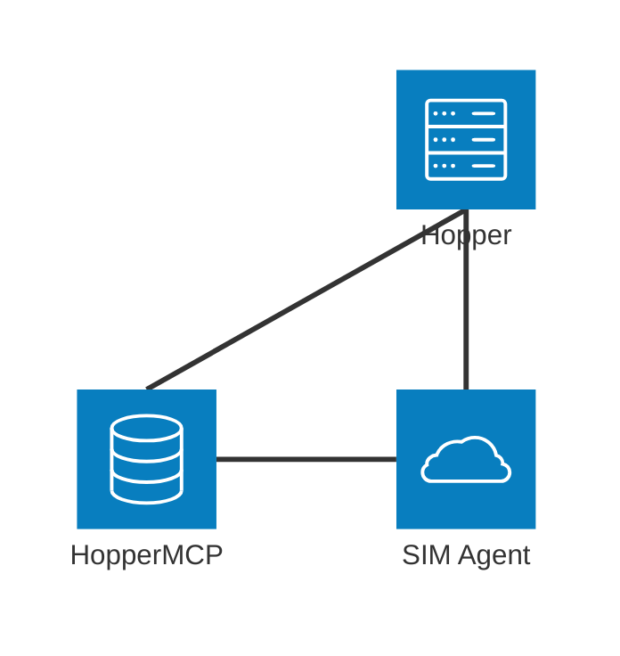

# Hopper 

Hopper is a basic chat client that can connect to AI agents using workflows built with [SIM](https://github.com/simstudioai/sim). 

## Requirements

This is a Django app with dependencies managed through [uv](https://docs.astral.sh/uv/). You can also run the application using Docker Compose.

### Installation Instructions

- [uv](https://docs.astral.sh/uv/getting-started/installation/)
- [Docker Desktop](https://www.docker.com/products/docker-desktop/)

## Run the app

To run the app, simply execute `uv run python manage.py runserver`. Then go to `http://localhost:8000/ask/` to access the app. If using Docker, you can start the app by executing `docker compose up` for local development or `docker compose -f docker-compose-prod.yml up` for a configurable version without a mock server.

## Architecture

Hopper talks to two other services: The SIM installation that provides access to the agent and HopperMCP, the MCP server used as a knowledge base. Hopper submits files to HopperMCP to be indexed and executes workflows via SIM to send requests to the agent.  

